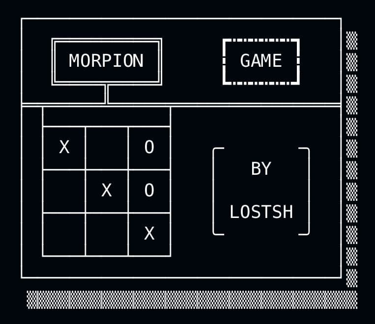

# Morpion
ceci est une version très minimaliste du jeu du morpion (TIC-TAC-TOE), basée sur l'utilisation des `sessons` en PHP.

If you want to play it, it is available on [this site](https://lostsh.github.io/assets/blog/2020-11-20/morpion.html). You just have to click "play now".

The project repository site is available at [this address](https://lostsh.github.io/morpion/), and the repository code is [here on github](https://github.com/lostsh/morpion).



## operating mode

The principle could not be simpler:

Let's build the page first, and we'll take care of making it work with the sessions in a second step.

1. With php we display an html table, in each cell we put a `<a> </a>` tag with as a link the number of the row on which the cell is located, and the number of the column (for pass them using a GET request)

```html
<table>
    <tbody>
        <tr>
            <td><a href="?col=0&lig=0&player=1">jouer</a></td>
            <td><a href="?col=1&lig=0&player=1">jouer</a></td>
            <td><a href="?col=2&lig=0&player=1">jouer</a></td>
        </tr>
        <tr>
            <td><a href="?col=0&lig=1&player=1">jouer</a></td>
            <td><a href="?col=1&lig=1&player=1">jouer</a></td>
            <td><a href="?col=2&lig=1&player=1">jouer</a></td>
        </tr>
        <tr>
            <td><a href="?col=0&lig=2&player=1">jouer</a></td>
            <td><a href="?col=1&lig=2&player=1">jouer</a></td>
            <td><a href="?col=2&lig=2&player=1">jouer</a></td>
        </tr>
    </tbody>
</table>
```

2. Once we have a nice grid we will add an `if` without putting any conditions there we can set it to` true` we will take care of the condition when we add the sessions. The objective is to obtain a grid of this type:

```html
<table>
    <tbody>
        <tr>
            <td>X</td>
            <td>X</td>
            <td><a href="?col=2&lig=0&player=1">jouer</a></td>
        </tr>
        <tr>
            <td>O</td>
            <td><a href="?col=1&lig=1&player=1">jouer</a></td>
            <td><a href="?col=2&lig=1&player=1">jouer</a></td>
        </tr>
        <tr>
            <td>O</td>
            <td><a href="?col=1&lig=2&player=1">jouer</a></td>
            <td>O</td>
        </tr>
    </tbody>
</table>
```
To build something like this:
```php
echo("<table><tbody>");
for($i=0;$i<3;$i++){
    echo("<tr>");
    for($j=0;$j<3;$j++){
        if(true){

            echo("<td><a href=\"?col=" .$j. "&lig=" .$i. "\">jouer</a></td>");

        }else{ //we will never go to the else, but it's ready for later
            if(true){
                echo("<td>X</td>");
            }else{
                echo("<td>O</td>");
            }
        }
    }
    echo("</tr>");
}
echo("</tbody></table>");
```

Now we can take care of the sessions to really make the noughts and crosses work, to simplify the task we are not going to worry about player 1 / player 2 we will do that later.

To store the state of the game we are going to use an array of 3 boxes by 3 boxes (nobody expected it eh?). And we're just going to ask our session to store our table, and give it back to us when we reload the page.

To do this, we can do a function which aims to initialize a 2D table filled with 0.
```
[0][0][0]
[0][0][0]
[0][0][0]
```
The function `intiTab()` return a 2D array.
```php
function initTab(){
    $tab = array();
    for($i=0;$i<3;$i++){
        for($j=0;$j<3;$j++){
            $tab[$i][$j] = 0;
        }
    }
    return $tab;
}
```
So let's go to the grid itself, we will be able to put a condition in the `if` earlier.
```php
echo("<table><tbody>");
for($i=0;$i<3;$i++){
    echo("<tr>");
    for($j=0;$j<3;$j++){
        if($gameStatus[$i][$j] == 0){
            echo("<td><a href=\"?col=".$j."&lig=".$i."\">jouer</a></td>");
        }else{
            if($gameStatus[$i][$j] == 1){
                echo("<td>X</td>");
            }else{
                echo("<td>O</td>");
            }
        }
    }
    echo("</tr>");
}
echo("</tbody></table>");
```

Now, we must put this magnificent game board in our session, if it exists we update it, otherwise we create it, we could see something like this:
```php
$gameStatus = initTab();
if(isset($_SESSION['gameStatus'])){
    $gameStatus = $_SESSION['gameStatus'];
}else{
    $_SESSION['gameStatus'] = $gameStatus;
}
```

So now, when we use the GET parameters that we put when we click on a box. To do so, we will simply say that if GET exists, then update the games teablau, and update the game board that we put in the session!

```php
if(
    isset($_GET['col']) && 
    isset($_GET['lig']) && 
    isset($_GET['player']) 
    )
{
    $gameStatus[$_GET['lig']][$_GET['col']] = 'X';
    $_SESSION['gameStatus'] = $gameStatus;
}
```

Now it works! well done ! now we will be able to play each turn, we will simply add a player attribute in our session which will be worth either 1 or 2

We create it like this:

```php
if(isset($_SESSION['player'])){

    //this allows to reverse the current player compared to the previous player
    if($_SESSION['player'] == 1){
        $_SESSION['player'] = 2;
    }else{
        $_SESSION['player'] = 1;
    }


}else{
    $_SESSION['player'] = random(1,2);
}
```

you have to update the array so that it is given as a parameter in the get like this:

```php
echo("<table><tbody>");
for($i=0;$i<3;$i++){
    echo("<tr>");
    for($j=0;$j<3;$j++){
        if($gameStatus[$i][$j] == 0){
            echo("<td><a href=\"?col=".$j."&lig=".$i."&player=".$_SESSION['player']."\">jouer</a></td>");
        }else{
            if($gameStatus[$i][$j] == 1){
                echo("<td>X</td>");
            }else{
                echo("<td>O</td>");
            }
        }
    }
    echo("</tr>");
}
echo("</tbody></table>");
```

**Well now the game seems to be working more or less well, let's move on to victory conditions!**

Good the most method is also the ugliest, but tempis I will come back to it later! For the moment it works.

A function which returns 0 if the whole row does not have the same value, and if in the whole row we have the same value then we return this value. And even functoin for a colone.
```php
/**
 * Return the numer 
 * if there is the same numer on all the $line of the $tab
 * else retrurn 0
 */
function isLineSameValue($line, $tab){
    $value = $tab[$line][0];
    for($i=0;$i<count($tab[$line])-1;$i++){
        if($tab[$line][$i] != $tab[$line][$i+1]){
            $value = 0;
        }
    }
    return $value;
}
/**
 * Return the numer 
 * if there is the same numer on all the $col of the $tab
 * else retrurn 0
 */
function isColSameValue($col, $tab){
    $value = $tab[0][$col];
    $colSize = (count($tab, COUNT_RECURSIVE) - count($tab[0])*count($tab[0]));
    for($i=0;$i<$colSize-1;$i++){
        if($tab[$i][$col] != $tab[$i+1][$col]){
            $value = 0;
        }
    }
    return $value;
}
```

Now a function that looks at the diagonal from top left to bottom right. Then a function that looks from top right to bottom left.
```php
/**
 * Return the numer duplicated on all a diagonale
 * if there is no same values, then it return 0
 */
function isDiagonalSameValue($tab){
    $size = 3;
    $diagOneVal = $tab[0][0];
    $diagTwoVal = $tab[0][$size-1];
    for($i=0;$i<$size-1;$i++){
        if($tab[$i][$i] != $tab[$i+1][$i+1]){
            $diagOneVal = 0;
        }
        if($tab[$i][$size-1-$i] != $tab[$i+1][$size-2-$i]){
            $diagTwoVal = 0;
        }
    }
    return ($diagOneVal!=0 || $diagTwoVal!=0)?($diagOneVal!=0?$diagOneVal:$diagTwoVal):0;
}
```

It only remains to gather this in a function which tells us if we have won or not, and if so which player has won.
```php
/**
 * Return 0 if no winer
 * Else return the numer of the winer {1 or 2}
 */
function whoWin($matrix){
    $winer = 0;
    $i=0;
    while($i<3 and $winer==0){

        if(isLineSameValue($i, $matrix) != 0){
            $winer = isLineSameValue($i, $matrix);
        }
        else if(isColSameValue($i, $matrix) != 0)
        {
            $winer = isColSameValue($i, $matrix);
        }
        else if(isDiagonalSameValue($matrix))
        {
            $winer = isDiagonalSameValue($matrix);
        }
        $i++;

    }
    return $winer;
}
```
We can see that a tie takes place when no one has won and the grid is full, so here is a function to check whether or not the grid is full.
```php
/**
 * Return true if the matrix is full
 */
function isMatrixFull($matrix){
    $isFull = true;
    $size = count($matrix);
    $i = 0;
    while($i<$size && $isFull){
        $j = 0;
        while($j<$size && $isFull){
            if($matrix[$i][$j] == 0){
                $isFull = false;
            }
            $j++;
        }
        $i++;
    }
    return $isFull;
}
```

**Voila, you have the main functional elements, you just have to assemble them, and add two or three things to make it work and you're done!**

## iframe
You may have noticed, the site on which the tic-tac-toe is located is a site hosted on `github pages`, but we cannot run php code! The obvious solution: it's an `iframe`. However I ran into some inconvenience of the `httpsOnly` type, or even `samesite`, anyway I will tell you about this in more detail.
